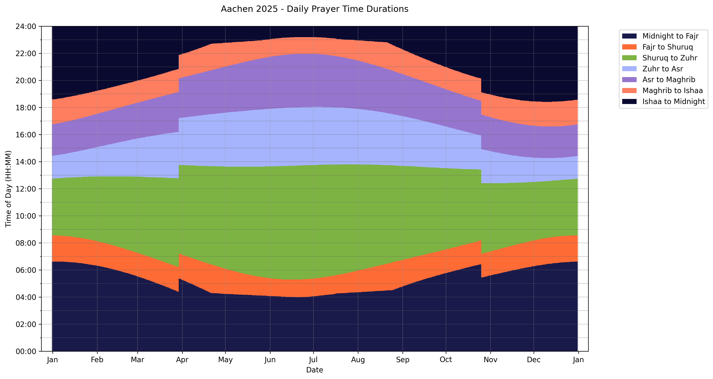

# Prayer Time Analyzer

This is a simple script to analyze prayer times from a CSV file. This repo is not affiliated with izaachen.de, you can use any other prayer time source to get your CSV table file.

## Generated Graph

## Usage

1. Download the csv file of your country and city from https://app.izaachen.de/ through the settings icon in the top right:

3. Put the CSV file next to the `analyze.py`
4. Rename the `CSV_FILE` in `analyze.py` to the name of your CSV filename
5. Execute `analyze.py`

The script will print out the first few rows of the dataframe with the added duration columns and then create a stacked bar graph showing the durations between prayer times and save it to the repo folder with the name of the CSV file + "_year_graph.png", see example image [here](Aachen_2025_year_graph.png).

## License

This script is licensed under the MIT License.

